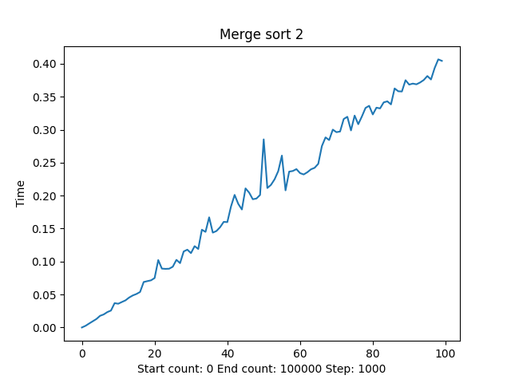
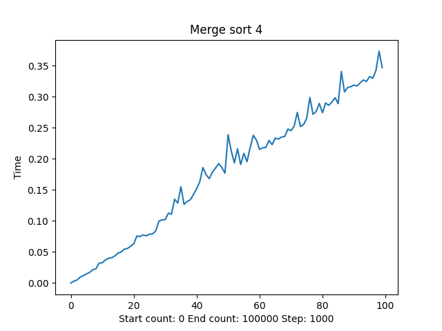
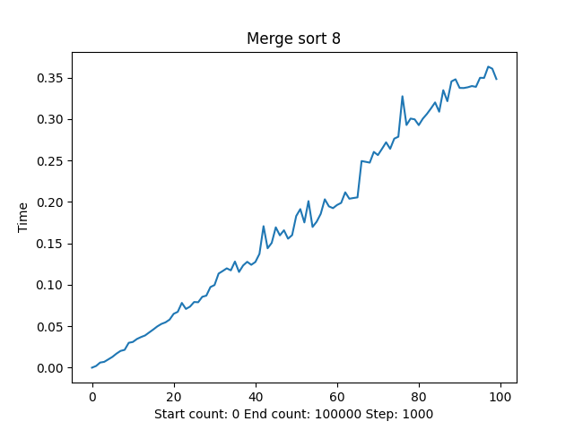

# Sorting_algorithms_app 

<h2>Составляющие лаб. работы:</h2>

<ul>
  <li>Реализация 2-х программ (алгоритмы и эксперименты).</li>
  <li>Сравнение и анализ двух предложенных алгоритмов, решающих одну и ту же задачу / проблему. </li>
</ul>

<h2>Реализация:</h2>

  <ul>
    <li><strong>algorithms_base:</strong> реализация алгоритмов в Jupyter Notebook;</li>
    <li><strong>experiments</strong> 
      <code>algorithms:</code> алгоритмы сортировок; 
      <code>get_data:</code> генерация синтетических данных; 
      <code>output:</code> итоги проведенных экспериментов; 
      
      
      
</li>
    <li><strong>realization</strong> 
      <code>algorithms:</code> реализация алгоритмов сортировок; 
      <code>app_design:</code> дизайн приложения; 
      <code>database:</code> данные для прогона алгоритмов (генерация синтетических данных и файлы); 
      <code>output:</code> данные после отработки алгоритмов (массивы и время); 
      <code>main.py:</code> запуск приложения;</li>
    <li><strong>requirements.txt:</strong> нужные утилиты для запуска приложения. (лучше использовать python 3.10 и venv)</strong></li>
  </ul>

